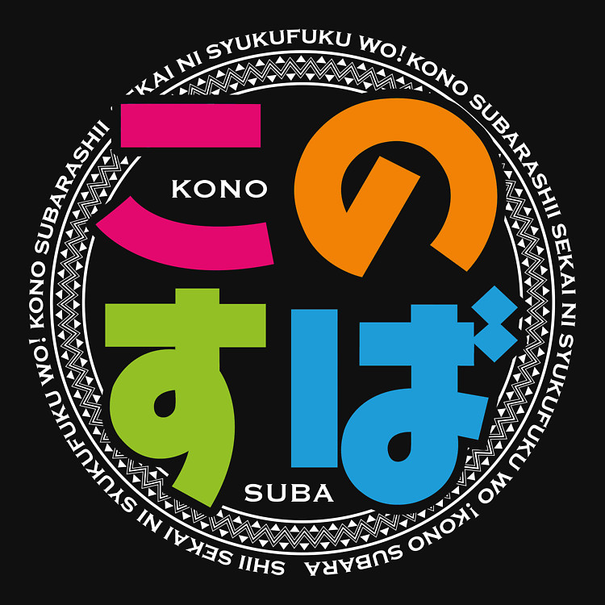
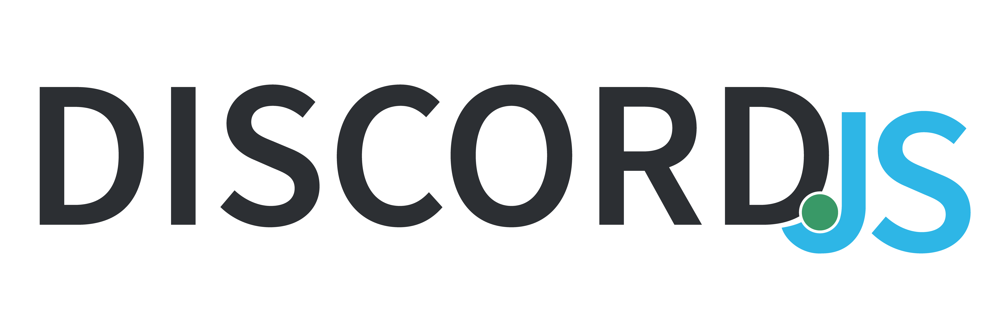

	

# adventurer-guild
<!-- TODO Add npm, node badges -->

	
	
	
	
	

Discord Bot using discord.js

PvP Game (inspired by konosuba) + other features.

## Download

Download the [repository here][D1].

[D1]: https://github.com/Makazzz/Adventurer-Guild/archive/master.zip

## Features

*	TODO

## Requirements

*	Microsoft Windows 7 or later.
*	[Node.js](https://nodejs.org/)
*	[discord.js](https://discord.js.org/)

## Development

TODO

Launch the bot by using "node index.js" in the console with [Node.js][D2] installed.

[Tutorial](https://www.digitaltrends.com/gaming/how-to-make-a-discord-bot/) I used for creating the bot.

## Credits

*	adventurer-guild is a fork of [adventurer-guild by stefanjack](https://github.com/stefanjack/adventurer-guild).

## License

*	adventurer-guild released with the [MIT license](https://raw.githubusercontent.com/Makazzz/adventurer-guild/master/LICENSE).
*	adventurer-guild by stefanjack is unlicense.
